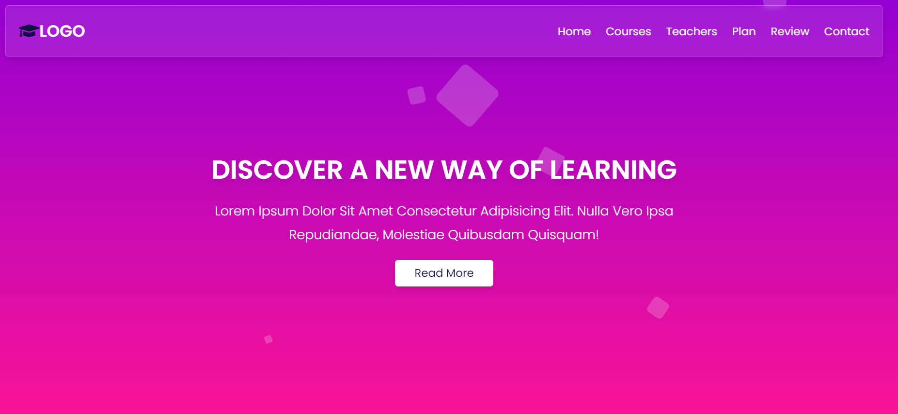

# Glassmorphism Styled Website

## Visão Geral

### Projeto simulando uma plataforma de cursos online. 



#
## Construido com:
- HTML
- CSS
- JavaScript

## Funcionalidades
- Menu de navegação por seções
- Design responsivo (mobile)
- Design conceito Glassmorfism

## O que eu aprendi:

- Animações com JS e CSS
```css
  @keyframes animate {
   0% {
      opacity: 0;
      transform: scale(0) translateY(-100%) rotate(0deg);
   }

   10% {
      opacity: 1;
   }

   90% {
      opacity: 1;
   }

   100% {
      opacity: 0;
      transform: scale(1) translateY(-500%) rotate(360deg);
   }
}

```

```js

  function createBox () {
   let span = document.createElement('span')

   span.classList.add('animated-box')

   let size = Math.random() * 80

   span.style.height = 40 + size + 'px'
   span.style.width = 40 + size + 'px'

   span.style.top = Math.random() * innerHeight + 'px'
   span.style.left = Math.random() * innerWidth + 'px'

   document.querySelector('.gradient-background').appendChild(span)

   setTimeout(() => {
      span.remove()
   }, 3000);
}

setInterval(createBox, 400)

```

- Manipulação do DOM com:
```js
  document.querySelector('.main-container')
  document.querySelectorAll('.btn')
  document.getElementById('submit')
```

- Eventos
```js
  menu.onclick = () => {
   menu.classList.toggle('fa-times')
   navbar.classList.toggle('active')
}

window.onscroll = () => {
   menu.classList.remove('fa-times')
   navbar.classList.remove('active')
}
```
- Boas práticas com JavaScript

## Link

Veja o projeto aqui: [Acessar 🌍](https://devhiderlan.github.io/glassmorphism-styled-website/) 

## Autor

Hiderlan Santana: [Linkedin](https://www.linkedin.com/in/hiderlan-santana/)